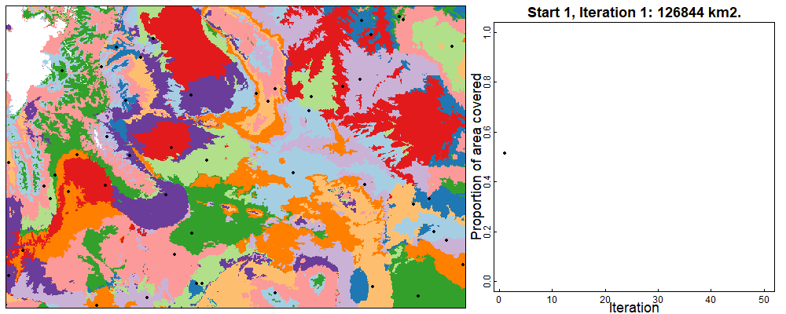
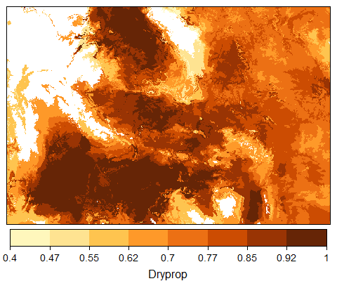
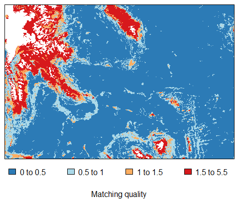
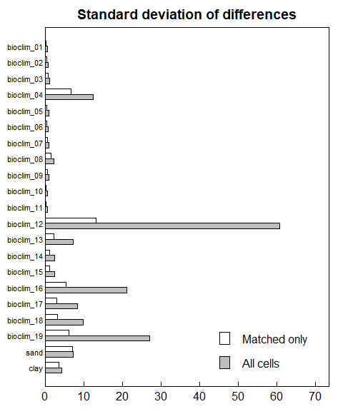
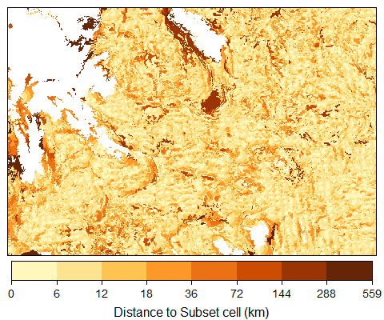
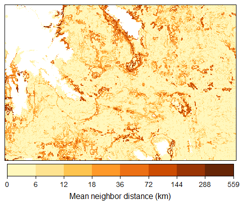
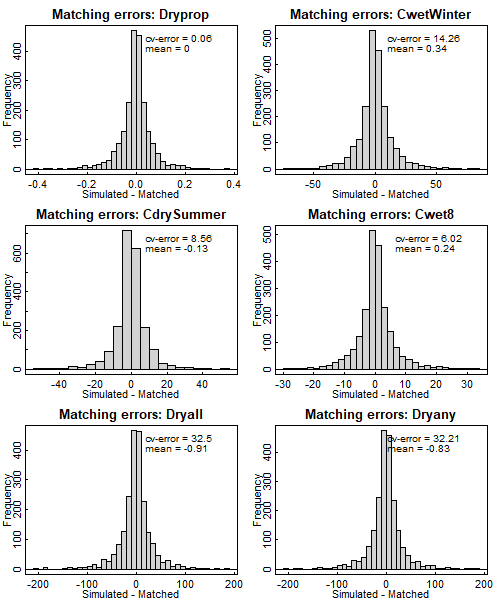

<!-- README.md is generated from README.Rmd. Please edit that file -->

# rMultivariateMatching: A package that uses multivariate matching to find representative simulation sites and generate high-resolution maps

<!-- badges: start -->
<!-- badges: end -->

The goals of rMultivariateMatching are a) to use multivariate matching
for cost-effective selection of optimal sites for simulation and b) to
interpolate simulation output from spatially sparse simulations to
create high-resolution datasets, as described in:

> Renne, R. R., Schlaepfer, D. R., Palmquist, K. A., Lauenroth, W. K., &
> Bradford, J. B. In preparation. Estimating complex ecological
> variables at high spatial resolution using cost-effective multivariate
> matching algorithms.

Simulation models are valuable tools for estimating ecosystem structure
and function under various climatic and environmental conditions and
disturbance regimes, but computational requirements can restrict the
number of feasible simulations. Thus, simulation models are often run at
coarse scales or for representative points and these results can be
difficult to use in decision-making. In this package, we have developed
cost-effective methods for interpolating multivariate and time series
simulation output to high resolution maps. This package includes tools
for:

1.  [Site Selection](#site-selection).

2.  [Interpolation](#interpolation) of complex multivariate and
    timeseries data to high-resolution maps

3.  [Estimation of matching and interpolation
    errors](#estimation-of-matching-and-interpolation-errors)

You can find examples of the site selection and interpolation methods in
print
[here](#examples-of-the-site-selection-and-interpolation-methods-in-print).

## Installation

To install the `rMultivariateMatching` package, please run the following
code.

``` r
# install.packages("devtools")
devtools::install_github("DrylandEcology/rMultivariateMatching", build_vignettes = TRUE)
```

There are four vignettes (referenced below) that provide step-by-step
guides for using the package. You can view these vignettes by running
the following code. Click on the ‘HTML’ links to view each vignette.

``` r
library(rMultivariateMatching)
browseVignettes("rMultivariateMatching")
```

## Examples

### Site selection

The site selection method (`kpoints`) is designed to select optimal
sites for simulation from within a study area, for the purpose of
applying the interpolation function `interpolatePoints` to interpolate
low spatial resolution simulation output to create high spatial
resolution maps of output variables across the study area. The site
selection method is meant to balance the cost of adding more sites (in
terms of computational or other resources) with the benefit of
representing a larger proportion of the study area.

Importantly, the site selection method could also be used to select an
optimal set of sites for field sampling.

Below is an example of site selection using the `kpoints` function to
find 50 points across drylands in the state of Wyoming. Please see the
‘Selecting points with rMultivariateMatching’ vignette for a more
detailed workflow of how to apply these methods.

``` r
library(rMultivariateMatching)

# Load targetcells data for Target Cells
data(targetcells)

# Create data frame of potential matching variables for Target Cells
allvars <- makeInputdata(targetcells)

# Select six matching variables
matchingvars <- allvars[,c("cellnumbers","x","y","bioclim_01","bioclim_04",
                        "bioclim_09","bioclim_12","bioclim_15","bioclim_18")]

# Solve kpoints for k = 200
results1 <- kpoints(matchingvars,criteria = c(0.7,42,3.3,66,5.4,18.4), 
                    klist = 50, n_starts = 10, min_area = 50, iter = 50,
                    raster_template = targetcells[[1]], 
                    verify_stop = FALSE, savebest = FALSE)
```

*Animation of the* `kpoints` *algorithm searching for a solution with 50
points across Wyoming drylands. In the figure on the left, colors
represent areas matched to the sites selected in the current iteration
(which are represented by the black points). The figure on the right
shows the proportion of the study area that is represented by the points
in each iteration.*



### Interpolation

Interpolation is accomplished by assigning output from each simulated
site to all sites in the study area that have been matched to it. There
are three vignettes that provide detailed workflows of how to apply
these methods, depending on matching method and whether or not your
simulation sites were selected using `kpoints`.

-   For interpolating simulation output from sites selected using
    `kpoints`, please refer to the ‘Matching and interpolation with
    kpoints’ vignette.

-   For interpolating simulation output from sites that were not
    selected using `kpoints`, please refer to the ‘Matching and
    interpolation without kpoints’ vignette.

-   For interpolating simulation output using a two-step matching
    process (as described in *Renne et al.*) using sites that were not
    selected using `kpoints`, please refer to the ‘Two-step matching and
    interpolation without kpoints’ vignette.

*Interpolation of DryPROP for the state of Wyoming. DryPROP refers to
the proportion of days that all layers in an ecologically relevant
portion of the soil are dry when soil temperature at 50 cm &gt;5 degrees
Celsius. Simulation output data used in the interpolation are from
Bradford et al. (2019).*



### Estimation of matching and interpolation errors

In *Renne et al.*, we suggest four methods of evaluating matching:

### 1. Calculate matching quality (measure of similarity between simulated and matched sites)

*Matching quality for an example using simulated sites from Bradford et
al. (2019). Values*  ≤ 1 *represent high quality matching.*



### 2. Calculate the standard deviation of differences between simulated sites and matched sites for a set of variables relevant to the project

*Standard deviation of differences between simulated and matched sites
using simulated sites from Bradford et al. (2019).*



### 3. Calculate geographic distances between matched cells

*Distance (km) between simulated sites and matched sites using simulated
sites from Bradford et al. (2019).*



*Average distance between the simulated site that is matched to a given
location and the simulated site that is matched to the eight adjacent
neighbors of that location using simulated sites from Bradford et
al. (2019).*



### 4. Leave-one-out cross-validation

*Errors estimated with leave-one-out cross-validation for six output
variables from Bradford et al. (2019).*



### Examples of the site selection and interpolation methods in print

In the site selection example in *Renne et al.*, our goal was to project
the impacts of climate change, wildfire, and lifestock grazing on big
sagebrush (*Artemisia tridentata*) plant communities in the western
United States using STEPWAT2, an individual-based, gap dynamics plant
simulation model (Palmquist et al., 2018; Palmquist et al., 2018). So,
we chose a set of six climate variables that capture the major drivers
of plant community structure in drylands as matching variables. We used
the site selection interpolation methods described in *Renne et al.* to
generate the maps of simulation output for a recent publication
investigating the projected impacts of climate change on big sagebrush
plant communities:

> Palmquist, K. A., Schlaepfer, D. R., Renne, R. R., Torbit, S. C.,
> Doherty, K. E., Remington, T. E., Watson, G., Bradford, J. B., &
> Lauenroth, W. K. (2021). Divergent climate change effects on
> widespread dryland plant communities driven by climatic and
> ecohydrological gradients. *Glob. Change Bio.*, 27(20), 5169-5185.
> <https://doi.org/10.1111/gcb.15776>

Interpolated datasets from the project are available from the US
Geological Survey Sciencebase:

> Renne, R. R., Palmquist, K. A., Schlaepfer, D. R., Lauenroth, W. K.,
> and Bradford, J. B. (2021). *High-resolution maps of big sagebrush
> plant community biomass using multivariate matching algorithms: U.S.
> Geological Survey data release.* <https://doi.org/10.5066/P9MNKWS4>.

### References

Bradford, J. B., Schlaepfer, D. R., Lauenroth, W. K., Palmquist, K. A.,
Chambers, J. C., Maestas, J. D., & Campbell, S. B. (2019).
Climate-driven shifts in soil temperature and moisture regimes suggest
opportunities to enhance assessments of dryland resilience and
resistance. *Front. Ecol. Evol*. 7:358.
<https://doi.org/10.3389/fevo.2019.00358>

Palmquist, K. A., Bradford, J. B., Martyn, T. E., Schlaepfer, D. R., &
Lauenroth, W. K. (2018). STEPWAT2: an individual-based model for
exploring the impact of climate and disturbance on dryland plant
communities. *Ecosphere*, 9(8). <https://doi.org/10.1002/ecs2.2394>

Palmquist, K. A, Schlaepfer, D. R., Martyn, T. E., Bradford, J. B., &
Lauenroth, W. K. (2018). DrylandEcology/STEPWAT2: STEPWAT2 Model
Description (Palmquist, et al., 2018 Ecosphere). Zenodo.
<https://doi.org/10.5281/zenodo.1306924>
